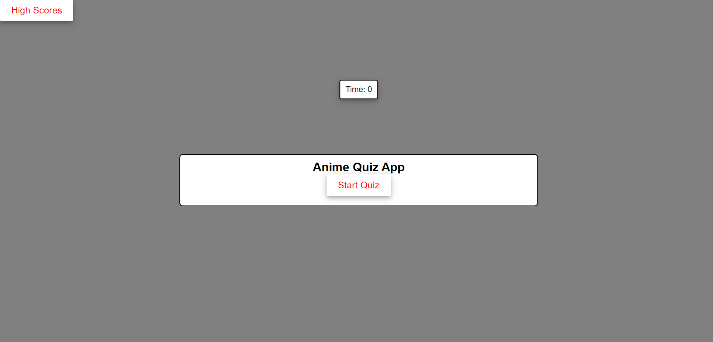
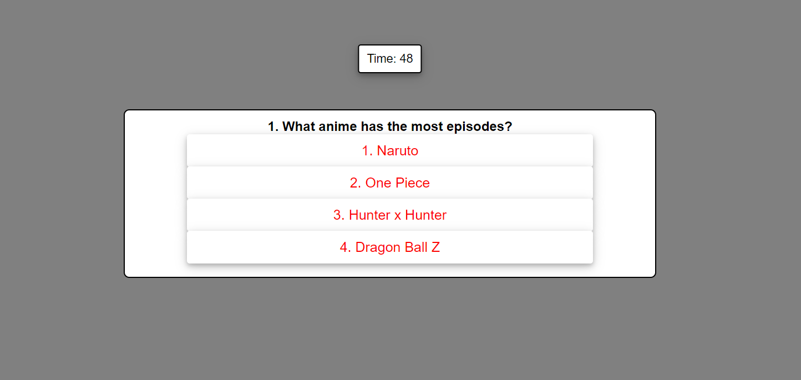

# CodingQuiz

## Description

It is a small coding quiz app I build using html, css, and javascript. It consists of 5 questions that are anime related.

## Usage

You start the quiz by pressing the "Start Button"
You will be quized on Anime 
5 questions will be answered by multiple choice
Time will be deducted if answered incorrectly
scored will be saved by the amount of correct choices and time left

<a herf=https://lsegura06.github.io/CodingQuiz> Website </a>

## Credits 

W3school.com
youtube.com
courses.bootcampspot.com
github.com